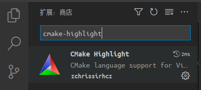

# VSCode CMake Highlight

This extension provides [CMake](http://www.cmake.org/) syntax highlighting for [Visual Studio Code](https://code.visualstudio.com/).

## Install

Search and install **`cmake-highlight`** in VSCode extension marketplace:




## Features

- Colorization
- Completion Lists


- Code comments


- Snippets


- Quick Help


- Access To Online Help


## Options

The following Visual Studio Code settings are available for the Cmake extension. These can be set in user preferences (cmd+,) or workspace settings (.vscode/settings.json).

```json
{
    "cmake.cmakePath": "/path/to/cmake"
}
```

## Commands

- `CMake: Online Help` to go to the CMake online documentation (according to the current cmake version).

## Local build

Install nodejs LTS from <https://nodejs.org/en/download> (instead of `apt` due to version too old):
```bash
node --version # v20.8.1
npm --vresion # 10.1.0
```

```bash
git clone https://github.com/zchrissirhcz/vscode-cmake-highlight.git
cd vscode-cmake-highlight

npm install -g @vscode/vsce
npm install typescript -g
npm install
...
vsce package # generate the .vsix file
# if your ~/.npmrc contains `prefix=~/.npm-global`, then use the following command
# ~/.npm-global/bin/vsce package
```

Change `index.d.ts` (`node_modules/@types/node/index.d.ts:20:1`)
```js
<reference lib="es2015" />
```
to
```js
<reference lib="es2015" >
```

## Acknowledgements

This extension is based on [CMake For VisualStudio Code](https://github.com/twxs/vs.language.cmake).

## License

[MIT](LICENSE)
